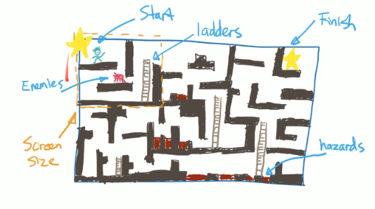
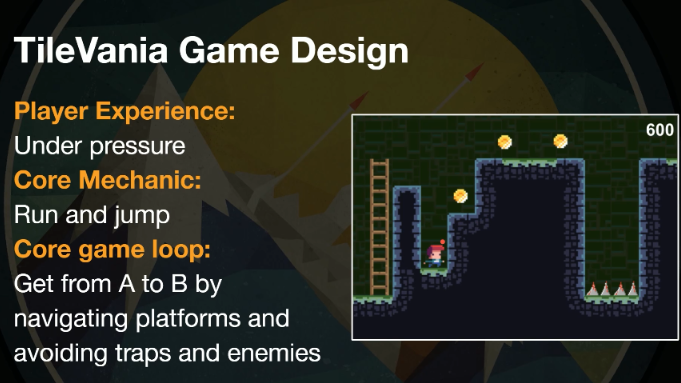

# TileVania

## Description
This is a 2D platformer game where the player must navigate through a series of levels to reach the end. The player must avoid obstacles and enemies to reach the end of the level. The game features multiple levels with increasing difficulty.

## Game design

## Game Mechanics

* Player movement: The player can move and jump.
* Traps: The player must avoid traps, or be killed, to reach the end of the level.
* A away to start and finish a level
* A Timer to create urgency

